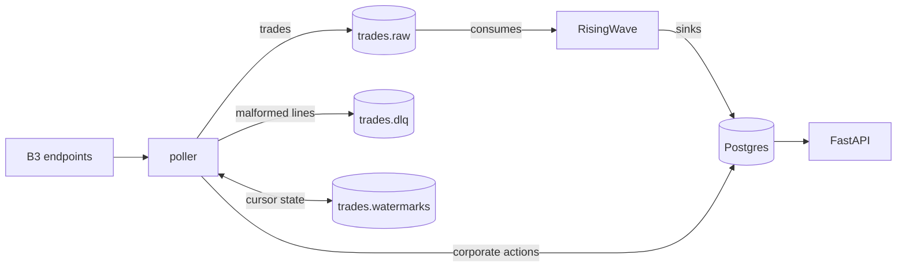
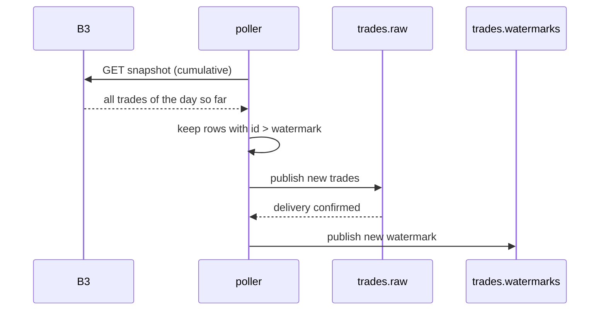
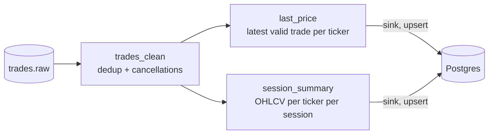
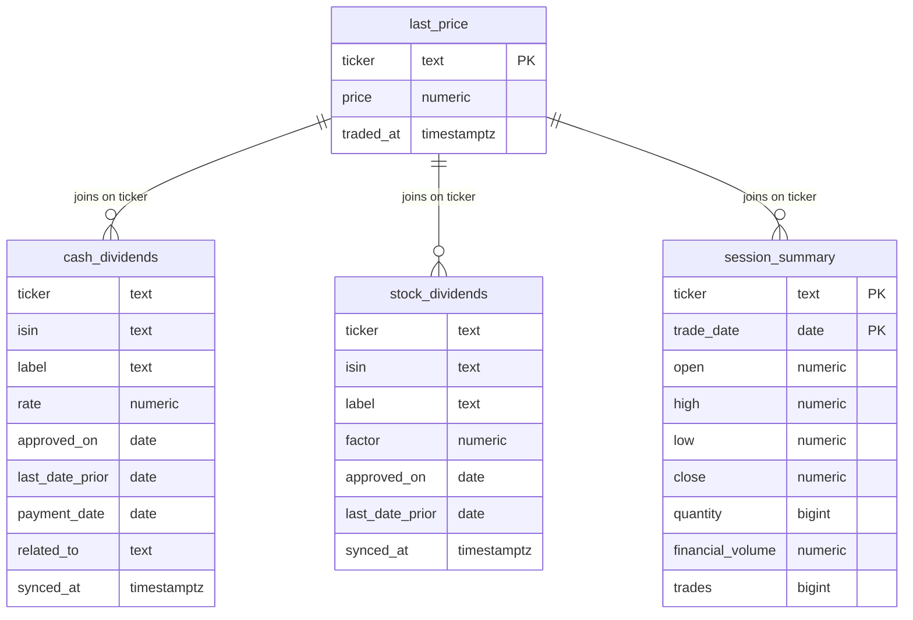
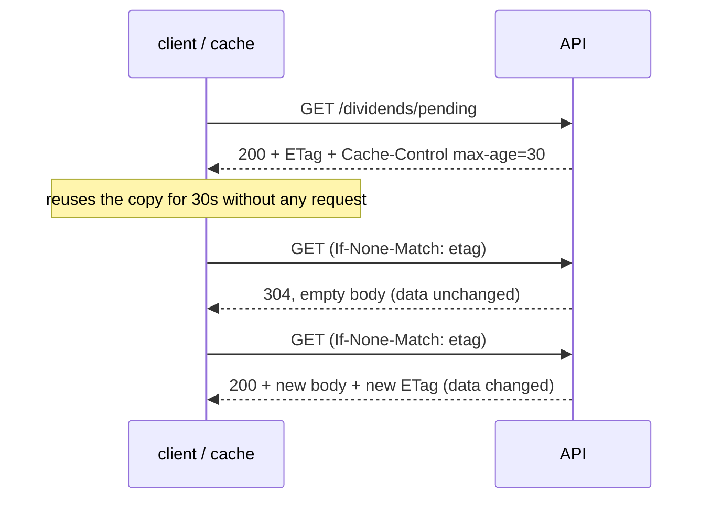

# Architecture

This document explains how each piece works and why it is shaped that way. For the
short version, start with the [README](README.md).



## Trade ingestion (B3 to Kafka)

B3 publishes trades as files, not as a feed. The relevant behaviors, all handled
explicitly:

- For the **current session**, a per-ticker endpoint serves a cumulative snapshot,
  delayed ~15 minutes and regenerated about once a minute. Each download contains every
  trade of the day so far.
- For **past sessions**, the same endpoint serves the final file. Files disappear after
  ~20 trading sessions, and an expired date answers HTTP 200 with an empty body, so
  success is defined as "has content-disposition and a non-empty body", never by status
  code alone.
- Lines use semicolon separators, comma decimals and a 9-digit HHMMSSmmm timestamp in
  São Paulo wall-clock time.

The poller runs three loops that converge on one code path (fetch, parse, filter,
publish):

| Loop | When | Purpose |
|---|---|---|
| Intraday poll | every 10 min, weekdays 09:55-18:35 São Paulo | keeps the stream flowing during market hours |
| Daily backfill | first in-window cycle of each day | fetches yesterday's final file, filling anything intraday missed |
| Boot backfill | on every start | sweeps the ~20 retained sessions, healing any downtime gap before B3 deletes the files |

Parsing happens once, at the boundary, into a typed record. The details that matter:

- **Money never becomes a float.** Prices stay decimal end to end (Python `Decimal`,
  JSON strings, Postgres `numeric`).
- **Timestamps are interpreted as São Paulo wall clock, then converted to UTC.** The
  timezone database handles historical daylight saving correctly.
- **A trade belongs to the session in `DataNegocio`, not to the file it came from.**
  After-market trades of session D are re-listed in D+1's file (with a bogus early
  timestamp), and trade ids restart every session, so all downstream keys use the trade's
  own session date.
- **Cancellations (`action = 2`) reuse the id of the trade they cancel.** They bypass the
  watermark filter and are resolved downstream ("last action wins").

Failures degrade one ticker at a time, never the loop: transient errors (5xx, network)
retry with exponential backoff; 404 means "not published" and is skipped; a line that
fails parsing goes to `trades.dlq` wrapped with the error, the source file and the raw
bytes, so it can be inspected and replayed later.

## Watermarking (how polling becomes a stream)

Each intraday snapshot re-serves the whole day, so publishing everything would send the
same trades ~50 times per session. The cursor that prevents this is the trade id itself:
ids are sequential per instrument within a session, so the poller keeps
`max(trade_id)` per `(ticker, session)` and publishes only what is above it.

The cursor state lives in Kafka, in a compacted topic, the same pattern Kafka uses for
its own consumer offsets:

```
topic: trades.watermarks (cleanup.policy=compact)
key:   "PETR4:2026-07-21"
value: {"max_trade_id": 338700}
```

At boot the poller reads the topic start to end and keeps the last value per key;
compaction eventually drops superseded records, which is a size optimization, never a
correctness requirement.



The ordering in the last two steps is the delivery contract: the watermark only advances
after every publish is confirmed. A crash in between re-publishes a few trades on the
next cycle (at-least-once); it never loses one. Duplicates are then collapsed
downstream, where deduplication is needed anyway, because B3 itself occasionally
re-lists rows across files.

## Corporate actions ingestion (B3 to Postgres)

The corporate actions API is a different animal: slow-moving reference data, refetched
in full on every sync (every 6 hours, plus once at boot). Its quirks, all handled at the
parsing boundary:

- Requests carry a base64-encoded JSON payload in the URL path, and errors come back as
  HTTP 200 with an empty body.
- Dates are `dd/mm/yyyy`, decimals use pt-br separators (including thousands dots), and
  a payment date of `31/12/9999` means "still to be defined", which is stored as NULL
  with the event kept, since it is a real pending dividend.

Because every sync fetches the complete current state per company, storage is a
transactional full replace per ticker: delete the ticker's rows, insert the fetched set,
commit. Amended events (a TBD payment date gaining a real date, installments that share
every field except the payment date) can never leave orphan rows behind. A failed fetch
for one company leaves its previous rows untouched.

## Stream processing (Kafka to Postgres)

RisingWave consumes `trades.raw` and maintains materialized views incrementally, so
serving-ready state always exists before anyone asks:



- `trades_clean` groups by `(ticker, trade_date, trade_id)`: redelivered duplicates
  collapse, and a cancellation row anywhere in the group marks the trade cancelled.
  NULL-keyed rows are filtered out, because the source accepts shape-mismatched JSON as
  null-filled rows rather than rejecting it.
- `session_summary` follows B3's official convention: OHLC over regular-session trades
  only; quantity, financial volume and trade count over all session types. The results
  reproduce B3's official end-of-day file (COTAHIST) field by field.
- Both serving views are sunk into Postgres with upserts keyed by their primary keys.

RisingWave checkpoints its state to a persistent volume: killed mid-stream, it resumes
from its own Kafka offsets and catches up with whatever was published while it was down.
Dropping and recreating a view rebuilds it from the topic deterministically.

### Why RisingWave?

The transform layer needs to deduplicate, resolve cancellations and keep a handful of
aggregates perpetually current over a modest stream (a few hundred thousand events per
day). The options weighed:

- **A hand-written Kafka consumer** works fine at this volume and remains the cheap
  fallback, since it would read the same topic. A streaming database expresses the same
  logic as declarative SQL and adds checkpointing, recovery and consistent incremental
  state for free.
- **Flink and Spark Streaming** are built for orders of magnitude more volume and bring
  cluster-grade operations (JVM, deployment and checkpointing infrastructure of their
  own) that would dominate this stack without adding correctness.
- **Kafka Streams** is a JVM library and would introduce a second language for a single
  component.

Among streaming databases, RisingWave fits this stack specifically: it is Apache 2.0
licensed, it runs as one binary with no JVM in a single-node mode with local
persistence, it speaks the Postgres wire protocol (any Postgres client works against
it), and it ships a native Postgres sink.

The adoption was validated rather than assumed: killed mid-stream it recovers from its
checkpoint and catches up; malformed input never stalls a partition; rebuilding a view
from the topic reproduces identical numbers; and real cancelled block trades in the
captured data exercised the last-action-wins logic.

## Data contracts

### Kafka topics

**`trades.raw`** (12 partitions, keyed by ticker so each instrument stays ordered,
7-day retention; history is recoverable from B3 within its window):

```json
{
  "schema_version": 1,
  "ticker": "PETR4",
  "trade_id": 30510,
  "action": 0,
  "price": "41.120",
  "quantity": 300,
  "traded_at": "2026-07-21T13:16:02.106000+00:00",
  "trade_date": "2026-07-21",
  "reference_date": "2026-07-21",
  "session_type": 1,
  "source": "intraday_poll"
}
```

`action`: 0 = new trade, 2 = cancellation. `source`: `intraday_poll` or `eod_file`.

**`trades.dlq`** (malformed lines, kept for inspection and replay):

```json
{
  "schema_version": 1,
  "ticker": "PETR4",
  "session_date": "2026-07-21",
  "filename": "21-07-2026_NEGOCIOSAVISTA_PETR4_1046.txt",
  "source": "intraday_poll",
  "error": "expected 11 fields, got 9: '...'",
  "raw_line": "..."
}
```

**`trades.watermarks`** (compacted) holds the ingestion cursor, one record per
`(ticker, session)`; its format is described in
[Watermarking](#watermarking-how-polling-becomes-a-stream).

### Postgres tables

The poller writes the two corporate actions tables (transactional full replace per
ticker); the RisingWave sinks upsert the two market tables; the API only reads. The
one-row-per-ticker `last_price` is what every dividend joins against.

The corporate actions tables deliberately have no primary key: dividend events have no
usable natural key (installments share every field except the payment date, which is
NULL while still to be defined), and the full-replace write model keeps the tables an
exact mirror of B3's current answer without one.



## Serving and caching

The API is read-only over Postgres. Dividend states are computed inside the query, on
the São Paulo calendar: `with_rights` while today is at or before the buy-by date (the
last day on which buying still earns the payout), `pending_payment` after it until the
money is paid. State is a function of the clock, so
materializing it would just create something to go stale at midnight.

Every payload is identical for all users and changes at most every few minutes, which
makes HTTP caching the whole scaling story:



The ETag is a hash of the actual response body, computed per request, so there is no
server-side cache and nothing to invalidate. `Cache-Control: public` means any CDN or
reverse proxy placed in front collapses arbitrary user traffic into a few origin
requests per TTL window without configuration.

`/health` reports per-source freshness and always answers 200: the API serves
last-known-good data by design, so staleness is information, not an error. Trade
freshness is only judged during market hours; an old price on a closed market is
healthy, and a broken pipeline cannot hide behind a weekend.

## Boot and self-healing

`docker compose up` orders itself: Kafka becomes healthy, `kafka-init` creates the
topics, Postgres becomes healthy, and `risingwave-init` waits for both RisingWave's
port and the serving tables (created by the poller at startup) before applying the
streaming schema, which is idempotent.

The recovery matrix, all automatic:

| Failure | Recovery |
|---|---|
| Poller down for hours or days | boot backfill re-fetches every session still available at B3 (~20) and publishes only what is missing |
| Crash between publish and watermark update | a few trades are re-published; downstream dedup collapses them |
| RisingWave killed mid-stream | resumes from checkpoint and its Kafka offsets, then catches up |
| Kafka or Postgres volume wiped | the next boot rebuilds all of it from B3 (corporate actions in seconds, trades within B3's retention window) |
| One B3 endpoint failing or a malformed file | that ticker or line is skipped and retried later; everything else proceeds |

### Trying the recovery yourself

The RisingWave row of the matrix is easy to verify by hand:

```bash
# 1. note the current state
docker compose exec -T postgres psql -h risingwave -p 4566 -d dev -U root \
  -c "SELECT count(*) FROM trades_clean;"

# 2. kill it mid-stream (SIGKILL, no graceful shutdown)
docker kill -s KILL solution-risingwave-1

# 3. bring it back; docker kill counts as a manual stop, so the restart
#    policy does not fire on its own
docker compose up -d risingwave

# 4. after pgwire answers again (a few seconds), re-run the count
docker compose exec -T postgres psql -h risingwave -p 4566 -d dev -U root \
  -c "SELECT count(*) FROM trades_clean;"
```

The count never goes down, and during market hours it moves past the old value within
minutes as RisingWave catches up on whatever the poller published while it was dead.
The same style of exercise works for the poller (`docker compose restart poller`: it
reloads its watermarks and republishes nothing) and for the full stack
(`docker compose down -v && docker compose up -d --build`: everything rebuilds from B3).

The honest limit: trades older than B3's ~20-session retention exist only in Kafka
(7-day retention) and in the Postgres aggregates. An immutable raw-file archive is the
planned addition that would make every failure above recoverable forever.
