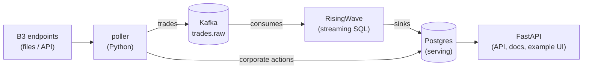

# B3 Market Data

A small platform that continuously captures live data from B3 (the Brazilian stock
exchange), processes trades as a stream, and serves the result as an HTTP API and a
consumable event stream. Its flagship question: which stocks have announced dividends
that haven't been paid out yet, and is there still time to buy them?

It tracks 10 liquid companies (Petrobras, Vale, Itaú, Bradesco, Ambev, Magazine Luiza and
others; see [`watchlist.py`](ingestion/src/ingestion/watchlist.py)).

## What you get

**HTTP API**, with the interactive OpenAPI spec at `/docs`:

| Endpoint | Answers |
|---|---|
| `GET /dividends/pending` | every announced-but-unpaid cash dividend, joined with the latest trade price |
| `GET /tickers/{ticker}/summary` | latest price, session OHLCV and pending dividends for one ticker |
| `GET /health` | freshness per source; distinguishes "market closed" from "pipeline broken" |

**Kafka event stream**: every trade of the watched tickers as an ordered, replayable log
(`trades.raw`, keyed by ticker; malformed records land in `trades.dlq` with full
context). Any other system can consume it directly.

**Postgres serving store**: corporate actions, latest prices and per-session OHLCV,
continuously maintained.

**Example UI**: a single-page dashboard built on the API, served at `/`. It shows pending
dividends grouped by ticker (total yield at the current price, gross vs. net, payment
calendar) and a market snapshot per ticker. It exists as a usage example; the API and the
stream are the product.

## Running it

Requires Docker with Compose v2.

```bash
./start.sh
```

The script brings the stack up and follows the initial trade backfill (one line per
session, a few minutes on a fresh environment), exiting when the data is ready. Plain
`docker compose up -d --build` works too if you prefer to skip the progress view.

Then open <http://localhost:8000/docs> (or the example dashboard at
<http://localhost:8000>).

On a fresh environment the boot is layered: corporate actions are synced within seconds,
so the dividend data is usable immediately; the last ~20 trading sessions of trades are
backfilled over a few minutes; during market hours (10:00-18:35 São Paulo) prices then
refresh every ~10 minutes. Everything is scheduled and self-healing. There are no manual
steps, and a fresh boot rebuilds the whole state from B3.

`docker compose down` stops the stack; add `-v` to also wipe the data (the next boot
recovers everything still inside B3's retention window).

## How it works

For the full detail on every mechanism (ingestion loops, watermarking, data contracts,
caching, recovery), see [ARCHITECTURE.md](ARCHITECTURE.md).



- **Poller** (Python): polls per-ticker trade snapshots every 10 minutes during market
  hours, fetches final session files daily, backfills any session missing from the last
  ~20 (B3 deletes older files) on every boot, and syncs corporate actions every 6 hours.
  Per-session watermarks, stored in a compacted Kafka topic, turn B3's cumulative
  snapshots into an incremental event stream.
- **Kafka** (KRaft, single node): the durable trade log. Delivery is at-least-once;
  downstream deduplication makes the end result exactly-once.
- **RisingWave**: streaming SQL over the log. Materialized views deduplicate
  redeliveries, apply trade cancellations ("last action wins"), maintain the latest price
  and per-session OHLCV incrementally, and sink the results into Postgres.
- **Postgres**: the only store the API reads.
- **API** (FastAPI): read-only endpoints, the OpenAPI docs and the example UI. Responses
  carry `ETag` and `Cache-Control` headers: every payload is identical for all users, so
  browsers revalidate with 304s and any HTTP cache or CDN placed in front collapses
  arbitrary user traffic into a few origin hits per TTL window.

Details that keep the numbers honest:

- Trade ids are sequential per instrument **per session** (and cancellations reuse the
  original id), so deduplication keys on (ticker, session, id, action).
- OHLC follows B3's official convention, regular-session trades only, and the daily
  summaries reproduce B3's official end-of-day file (COTAHIST) exactly, field by field.
- Dividend states (`with_rights`, `pending_payment`) are a function of the clock, so they
  are computed at query time and can never go stale.
- Money is decimal end to end and travels as strings in JSON.
- `/health` judges trade freshness only during market hours: an old price on a closed
  market is healthy, and a broken pipeline never hides behind a weekend.

## Data sources

| Source | Provides | Notes |
|---|---|---|
| `arquivos.b3.com.br/rapinegocios/tickercsv` | tick-by-tick trades | ~15 min intraday delay; files stay online for ~20 sessions |
| `sistemaswebb3-listados.b3.com.br` | corporate actions | dividends, JCP, splits |
| `bvmf.bmfbovespa.com.br` (COTAHIST) | official EOD quotes | validation reference for the aggregates |

All are public, unauthenticated B3 endpoints; delays and retention are theirs.

## Development

```bash
uv sync --all-packages   # install the workspace
uv run pytest            # test suite, no network required
uv run ruff check .      # lint
```

Monorepo layout: [`ingestion/`](ingestion) captures both sources, [`api/`](api) serves,
and [`risingwave/schema.sql`](risingwave/schema.sql) defines the streaming views. Images
are built from the single root [`Dockerfile`](Dockerfile).

## Known limits

- B3's endpoints are unofficial and intraday data is ~15 minutes delayed; the UI and the
  API expose data age explicitly rather than pretending otherwise.
- Everything runs single-node by design: cheap and simple. An immutable raw-file archive
  (for replay beyond Kafka's retention and B3's 20-session window) is the main planned
  addition.
- JCP net values assume the standard 15% IRRF withholding; tax figures are informational.
